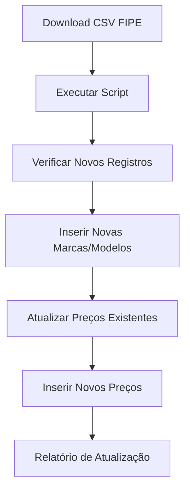

# Sistema FIPE Normalizado - OcarHub

## 📋 Visão Geral

Sistema completo de tabelas normalizadas para gerenciar dados FIPE de forma eficiente e escalável.

## 🗄️ Estrutura das Tabelas

### 1. `ocar_fipe_brands` - Marcas
```sql
- id (UUID, PK)
- name (VARCHAR, UNIQUE) - Ex: "Honda", "Toyota"
- code (VARCHAR) - Código da marca
- active (BOOLEAN) - Se a marca está ativa
- created_at, updated_at
```

### 2. `ocar_fipe_models` - Modelos Base
```sql
- id (UUID, PK)
- brand_id (UUID, FK) - Referência à marca
- name (VARCHAR) - Ex: "Civic", "Accord", "City"
- full_name (VARCHAR) - Nome completo (opcional)
- active (BOOLEAN) - Se o modelo está ativo
- created_at, updated_at
- UNIQUE(brand_id, name)
```

### 3. `ocar_fipe_prices` - Preços FIPE
```sql
- id (UUID, PK)
- model_id (UUID, FK) - Referência ao modelo
- version (VARCHAR) - Ex: "Sedan 1.8 EX", "Hatchback Touring"
- year (INTEGER) - Ano do veículo
- fipe_code (VARCHAR) - Código FIPE
- reference_month (VARCHAR) - Ex: "2025-09"
- price (DECIMAL) - Preço FIPE
- created_at, updated_at
- UNIQUE(model_id, version, year, reference_month)
```

## 🚀 Como Implementar

### Passo 1: Criar Tabelas
```bash
# Execute no Supabase SQL Editor
database/create-normalized-fipe-tables.sql
```

### Passo 2: Migrar Dados Existentes
```bash
node scripts/migrate-to-normalized-tables.js
```

### Passo 3: Instalar Função de Filtros
```bash
# Execute no Supabase SQL Editor
database/filtros-normalized-function.sql
```

### Passo 4: Testar Sistema
```bash
# Testar API
curl "http://localhost:3000/api/ocar/filtros?marca=Honda"
```

## 📅 Atualização Mensal

### Script de Atualização
```bash
# Atualizar preços mensalmente
node scripts/update-monthly-prices.js ./tabelafipe.csv 2025-10
```

### Processo Automatizado
1. **Download CSV** da FIPE
2. **Executar script** de atualização
3. **Verificar novos registros** automaticamente
4. **Atualizar preços** existentes

## 🔧 Vantagens do Sistema

### ✅ Performance
- **Índices otimizados** para consultas rápidas
- **Relacionamentos** bem definidos
- **Consultas eficientes** com JOINs

### ✅ Escalabilidade
- **Tabelas separadas** por responsabilidade
- **Fácil adição** de novas marcas/modelos
- **Histórico de preços** por mês

### ✅ Manutenibilidade
- **Dados normalizados** sem duplicação
- **Integridade referencial** garantida
- **Triggers automáticos** para updated_at

### ✅ Flexibilidade
- **Filtros encadeados** eficientes
- **Busca por qualquer campo**
- **Relatórios** personalizados

## 📊 Exemplos de Uso

### Buscar Marcas
```sql
SELECT name FROM ocar_fipe_brands WHERE active = true ORDER BY name;
```

### Buscar Modelos de uma Marca
```sql
SELECT m.name 
FROM ocar_fipe_models m
JOIN ocar_fipe_brands b ON m.brand_id = b.id
WHERE b.name = 'Honda' AND m.active = true
ORDER BY m.name;
```

### Buscar Preços por Modelo
```sql
SELECT p.version, p.year, p.price, p.reference_month
FROM ocar_fipe_prices p
JOIN ocar_fipe_models m ON p.model_id = m.id
JOIN ocar_fipe_brands b ON m.brand_id = b.id
WHERE b.name = 'Honda' AND m.name = 'Civic'
ORDER BY p.year DESC, p.price ASC;
```

## 🎯 Próximos Passos

1. **Interface Administrativa** para gerenciar marcas/modelos
2. **API de Relatórios** para análises
3. **Sistema de Notificações** para novos registros
4. **Dashboard** de métricas FIPE

## 🔄 Fluxo de Atualização Mensal



## 📈 Benefícios para o Negócio

- **Dados sempre atualizados** com preços FIPE
- **Performance otimizada** para consultas
- **Escalabilidade** para crescimento
- **Manutenção simplificada** do sistema
- **Relatórios precisos** e rápidos
